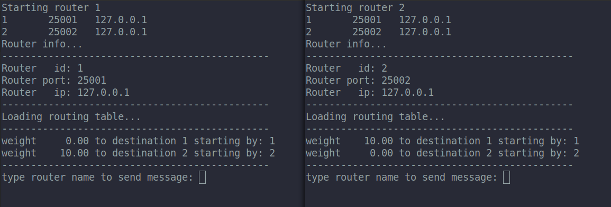

# Network Routing Simulator

Simulates a network routing using UDP transport protocol

### How do I get set up? ###

To run this project locally, first of all you need to clone this repository, the project had the following requirements: 

#### Requirements ####

* docker
* docker-compose

To run the project you need to run the following script (only in the first time): 

```sh
./install-deps.sh
```

It will download another repository with some c libraries, after do it for the first time, you just need to run the command below to start tha application:

```sh
./create-network.sh
```

The program will create a network based on 2 input files stored on `inputs` folder. These files has the following objectives:

* routers.config: network routers specifications, containing router id, listening port and router IP
* links.config: links between routers specifying 2 routers and the link weight

### Input files configuration example: 

#### router.config:
```csv
1	25001	127.0.0.1
2	25002	127.0.0.1
```

This examples declares two routers with Ids 1 and 2. The Router with Id are on IP 127.0.0.1 listening on port 25001. 

The router Id must be an integer number. 

#### links.config:
```csv
1	2	10
```

This example specifies that router id 1 has a link with weight 10 to router 2. Links are undirectional.

On this example the program looks like this:

